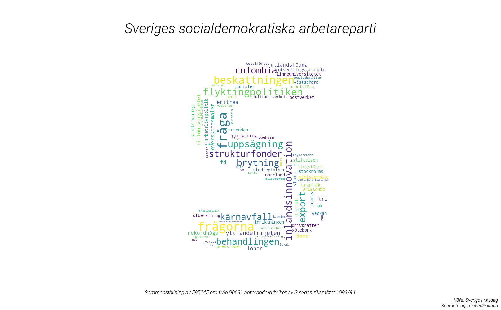

# RiktigPolitik
Politiska sammanställningar, twitterbotar och annat gott. Mest dumma projekt och hopplösa fix-ider.    

## Projekt
### Partiers mest överanvända ord
Visualisering av riksdagspartiernas ordanvändning under anföranden (ej replik). 
Datan är samlad från "Riksdagens öppna data". Varje ords storlek är en representation av hur pass 
mycket oftare partiet använder nämner ordet i förhållande till övriga riksdagspartier. 

I skrivande stund behandlas sammanlagt 1633543 ord från riksdagens 8 partier plus Folkpartiet 
som kombineras med L.

#### Socialdemokraternas överanvända ord
1. fråga, 158 % mer än snittet
2. frågorna, 143 % mer än snittet
3. beskattningen, 114 % mer än snittet
4. flyktingpolitiken, 94 % mer än snittet
5. inlandsinnovation, 92 % mer än snittet
6. uppsägning, 87 % mer än snittet
7. behandlingen, 84 % mer än snittet
8. colombia, 84 % mer än snittet
9. strukturfonder, 83 % mer än snittet
10. brytning, 83 % mer än snittet
11. ...

 ### Todo
 * Matchande färgschema som partifärg (Kanske?)
