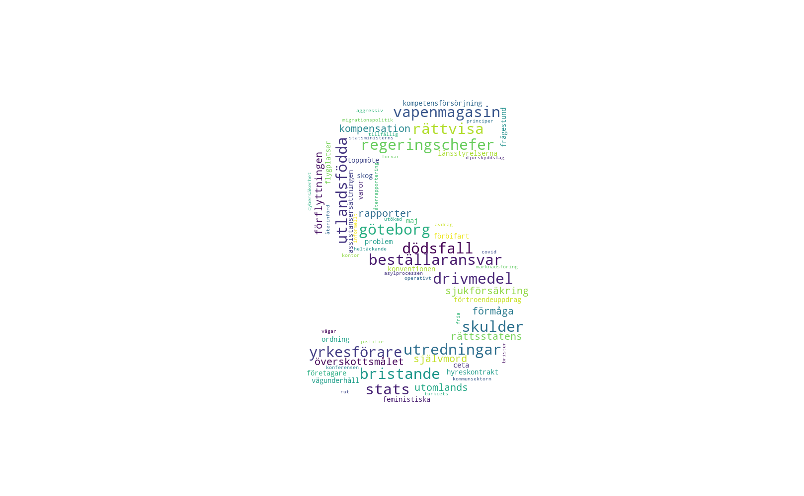

# RiktigPolitik
Politiska sammanställningar, twitterbotar och annat gott. Mest dumma projekt och hopplösa fix-ider.    

## Projekt
### Partiers mest överanvända ord
Visualisering av riksdagspartiernas ordanvändning under anföranden (ej replik). 
Datan är samlad från "Riksdagens öppna data". Varje ords storlek är en representation av hur pass 
mycket oftare partiet använder ordet i förhållande till övriga riksdagspartier. 

#### Socialdemokraternas överanvända ord
1. göteborg, 120 % mer än snittet
2. bristande, 115 % mer än snittet
3. dödsfall, 102 % mer än snittet
4. utredningar, 92 % mer än snittet
5. 12-13, 88 % mer än snittet
6. stats-, 83 % mer än snittet
7. regeringschefer, 83 % mer än snittet
8. vapenmagasin, 83 % mer än snittet
9. beställaransvar, 83 % mer än snittet
10. drivmedel, 83 % mer än snittet 
11. ...

 ### Todo
 * Matchande färgschema som partifärg
 * Fullständigt partinamn under
 * Tweeka text storklek och mängd ord
 * Lägg till "Källa: Sveriges riksdag"
 * Lägg till signering / "Bearbetning av"
 * Moooaaar data